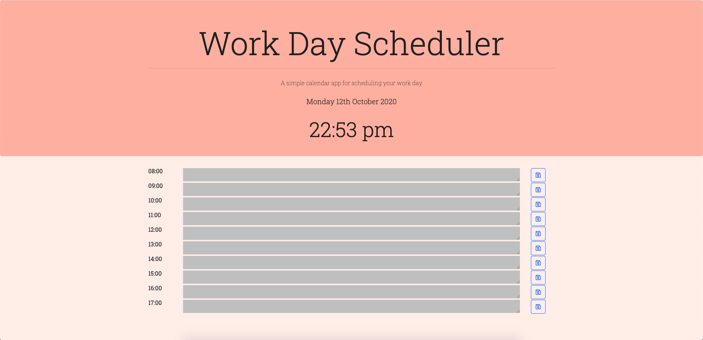
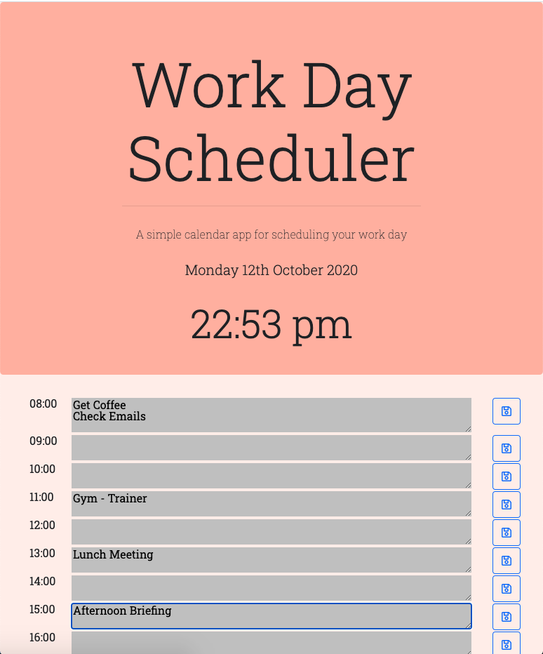

# Day Scheduler

This time around we were tasked with programing a nice and easy to use day planner. Kind of like an online diary. 

[Check it Out!](https://tallglassof-milkjake.github.io/dayplanner/)

The technologies used are as follows;
* jQuery
* JavaScript
* Moment.js
* Local Storage
* HTML
* CSS

JavaScript and jQuery were used as the backbone of the page to control the DOM and to form functions and assist in moving data to local storage.
Moment.js was used to give current time under main heading on page load.
Then it was utilised to set classes to the hour blocks and using those classes and some CSS it was made to change the colour of the blocks depending on the time of day. Past = grey, present = blue and future = green.

